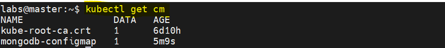
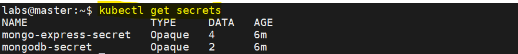
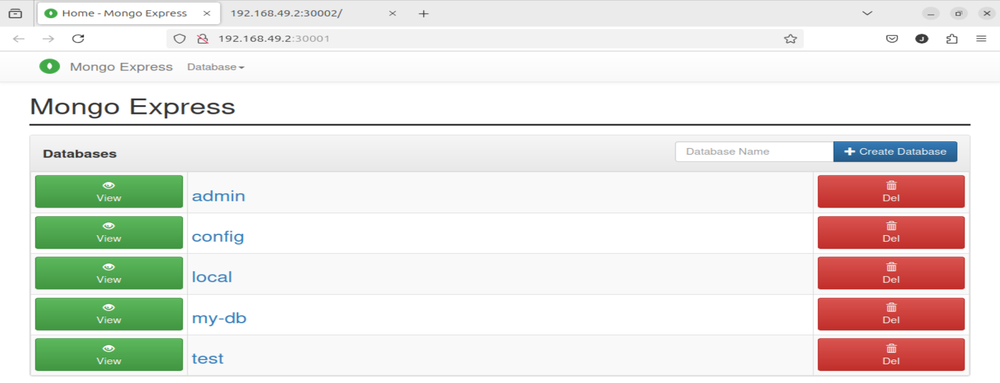

## demo app - developing with Kubernetes
<p align="center">
    
</p>

<div style="text-align: justify">

## Project Architecture

1. Web Application
2. MongoDB
3. MongoExpress
4. Kubernetes resources
    - ConfigMaps
    - Secrets
    - Deployments
    - Services (ClusterIP, NodePort)
    - Volumes (PV, PVC)

## What is MongoDB?
MongoDB is a NoSQL Open-source Document Oriented Database developed for storing and processing high volumes of data. Compared to the conventional relational databases, MongoDB makes use of collections and documents instead of tables consisting of rows and columns. The Collections consist of several documents and documents containing the basic units of data in terms of key and value pairs. 

Introduced in February 2009, the MongoDB database is designed, maintained, and managed by MongoDB.Inc under SSPL(Server Side Public License). Organizations such as Facebook, Nokia, eBay, Adobe, Google, etc. prefer it for efficiently handling and storing their exponentially growing data. It offers complete support for programming languages such as C, C++, C#, Go, Java, Node.js, Perl, PHP, Python, Motor, Ruby, Scala, Swift, and Mongoid.


## What is Mongo Express?

Mongo-Express is an interactive lightweight Web-Based Administrative Tool to effectively manage MongoDB Databases. Written with Node.js, Express, and Bootstrap3, Mongo Express can be used to simplify several MongoDB Admin tasks. Using Mongo Express, you can add, delete or modify databases, collections, and documents. With GridFS support, Mongo Express allows you to easily handle and process incredibly large files. It also offers complete support for BSON Data Types in documents, Custom CA and CA validation disabling & Replica Sets. Since it is also based on Bootstrap 3, Mongo Express is Mobile responsive. 

## Project explained

- Persistent Volume (PV) is attached to the MongoDB and used with a Persistent Volume Claim (PVC) object.
- Mongo-Express is used for MongoDB administration where we connect to the Database for creating/removing/updating items.
- Mongo-Express has access to the database by the internal service (ClusterIP).
- Users utilize Mongo-Express to administrate the MongoDB. Mongo-Express, located in the cluster, is accessible through a web browser using an external connectivity service (NodePort).
- The webapp communicates with the MongoDB using an internal service (ClusterIP).
- Users use a web brower to get access to the webapp in the cluster through an external service (NodePort).
- ConfigMap helps to store non-confidential data in key-value pairs such as the url to the MongoDB.
- Secret stores sensitive data such as username and password for the MongoDB and Mongo-Express.  

## Project Deployment
1. Create ConfigMap Resource Object

In the root of the Project folder, there is a manifest file `configmap.yaml` for the ConfigMap resource object.

```bash
kubectl apply -f configmap.yaml
```

```bash
kubectl get cm # List of configMaps in the current namespace
```

<p align="center">
    
</p>

2. Create the Secret Resource Object

In the root of the Project folder, there is a manifest file `secret.yaml` for the Secret resource object.

```bash
kubectl apply -f secret.yaml
```

```bash
kubectl get secrets # List of secrets in the current namespace
```

<p align="center">
    
</p>

3. Create the PV and PVC

- Connect or SSH into each node to create a folder for MongoDB data.

```bash
ssh -i <your_key_pair> <username>@<Node_IP>
```

```bash
sudo mkdir -p /mnt/kubernetes/volumes/mongo_data
```

**This must be done on each node of the cluster.**

- CD into the folder `pv` where there is a file `pv-pvc.yaml` and execute the following command.

```bash
kubectl apply -f pv-pvc.yaml
```

```bash
kubectl get pv # List of pv in the current namespace
```

```bash
kubectl get pvc # List of pvc in the current namespace
```

<p align="center">
    
</p>

<p align="center">
    
</p>

4. Deployment of MongoDB and Mongo-Express

CD to the folder `db` and execute the following commands.

```bash
kubectl apply -f mongo.yaml
```
And then

```bash
kubectl apply -f mongo_express.yaml
```

```bash
kubectl get deployment # List of deployments in the current namespace
```

```bash
kubectl get pods # List of pods in the current namespace
```

```bash
kubectl get svc # List of services in the current namespace
```

<p align="center">
    
</p>

5. Deployment of the webapp

CD into the app folder and execute the following command.

```bash
kubectl apply -f webapp.yaml
```

```bash
kubectl get deployment # List of deployments in the current namespace
```

```bash
kubectl get pods # List of pods in the current namespace
```

```bash
kubectl get svc # List of services in the current namespace
```

<p align="center">
    
</p>

## Results

1. Access to Mongo-Express

Minikube is used here.
<p align="center">
    
</p>

<p align="center">
    
</p>

2. Access to Webapp

<p align="center">
    
</p>


## Cleanup

```bash
kubectl delete all --all
```

```bash
kubectl delete secret mongodb-secret
```

```bash
kubectl delete secret mongo-express-secret
```

```bash
kubectl delete cm mongodb-configmap
```

```bash
kubectl delete pv mongo-pv
```

```bash
kubectl delete pvc mongo-pvc
```

</div>